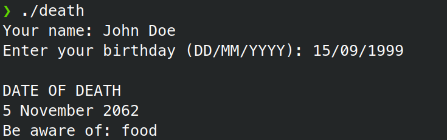

# death

A program that predicts your death date (Learning project)



## Installation

Download an executable from
[Releases page](https://codeberg.org/wadrodrog/death/releases)

## Usage

```
death [OPTIONS]
```

### Options

```
  -n, --name <NAME>           Your name
  -b, --birthday <BIRTHDAY>   Your birthday
  -d, --death-reasons <FILE>  Custom death reasons file
  -h, --help                  Print help
  -V, --version               Print version
```

## Build

You need [Cargo](https://doc.rust-lang.org/cargo/index.html) to build this
program.

```
$ git clone https://codeberg.org/wadrodrog/death.git
$ cargo build
$ ./target/debug/death
```
